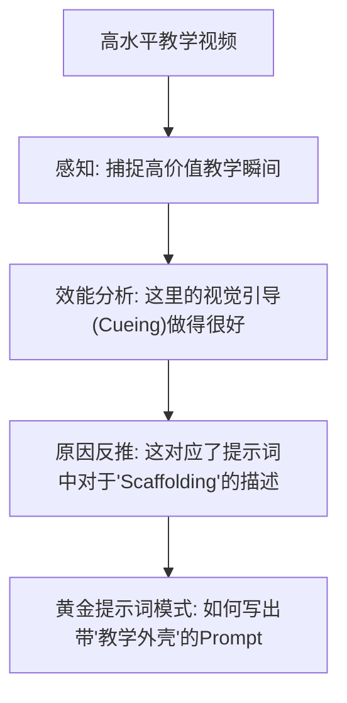

# “向上溯源反推”核心逻辑：探索“好视频”背后的“好提示词”

本指南旨在揭示：**什么样的提示词（Prompt）能够生成高质量的、能让学生产生深度学习的教学视频？** 我们的重点不是简单的视频要素拆解，而是“教学效能”与“提示词参数”之间的因果建模。

## 1. 核心深度逻辑：因果追踪

我们要建立的不是“视频 $\rightarrow$ 描述”的映射，而是“提示词特征 $\rightarrow$ 教学效果”的追踪。

## 2. 三大核心突破方向

### 一、 识别“教学视觉支架”（Instructional Scaffolding）
*   **反推重点**：分析提示词中使用了哪些词汇（如：`Exploded view`, `Schematic`, `Slow-motion focus`）能有效降低学生的认知负荷。
*   **应用**：教给师范生，生成复杂的抽象概念（如物理运动）时，必须在 Prompt 中加入“视觉支架”参数。

### 二、 反推“分镜意图”与“知识逻辑”的匹配度
*   **反推重点**：好的教学视频往往在讲到重点时会有特定的镜头切换。我们要反推什么样的 Prompt（如：`Cinematic close-up during explanation`, `Two-shot comparison`）能实现这种知识点的视觉转场。

### 三、 提取“沉浸感”参数
*   **反推重点**：反推风格词（Style Words）对学习动机的影响。例如，是“写实风格”还是“3D 动画风格”在特定学科（如生物）中更有助于记忆？

## 3. 专利与论文的高阶切入点

**你可以申报如下方向的专利：**
1.  **一种基于 AIGC 提示词的教学资源生成效能评估与反馈方法**：通过反推结果衡量用户输入的提示词是否达到了“教学专家级”的标准。
2.  **一种基于逆向工程的优质教学资源提示词推荐系统**：根据视频画面直接推荐能生成此类高质量内容的“底层提示词逻辑”。

## 4. 给师范生的实训目标
不仅仅是学会写 `A robot dancing`，而是学会写：
> “A 3D scientific visualization of a beating heart, **using color-coded blood flow** for clarity, **shot in a professional lecture style**, high-detail textures, **ensuring no visual clutter** for educational focus.”
