# 向上溯源反推系统：技术架构与实施方案
# Reverse Tracing System for Pedagogical Prompts

## 1. 总体架构设计 (System Architecture)

本架构旨在实现从“教学视频”到“黄金提示词”的逆向推理。系统模仿人类专家的认知过程，分为四个核心层次：感知层、推理层、优化层和应用层。

### 核心架构图 (Architecture Diagram)

### 核心架构图 (Model Architecture Schema)

```mermaid
graph LR
    %% Styles
    classDef container fill:#fff,stroke:#333,stroke-width:2px,stroke-dasharray: 5 5;
    classDef module fill:#e3f2fd,stroke:#1565c0,stroke-width:2px;
    classDef vector fill:#fff9c4,stroke:#fbc02d,stroke-width:1px;
    classDef process fill:#f3e5f5,stroke:#7b1fa2,stroke-width:1px;

    subgraph Framework [Pedagogical Prompt Reverse Tracing Framework]
        direction LR

        %% Module 1: Perception (Encoder)
        subgraph Encoder [Module 1: Pedagogical Perception Encoder]
            direction TB
            Input[Bi-modal Input] --> FeatExt[Feature Extraction]
            
            subgraph Vectors [Feature Embeddings]
                direction LR
                V[Video Tokens $v_1, v_2...v_n$]:::vector
                A[Audio Tokens $a_1, a_2...a_n$]:::vector
            end
            FeatExt --> Vectors
            
            Vectors --> Scaffolding[Scaffolding Attention Layer]:::process
            Scaffolding --> ContextVec[Context Vector $C$]:::vector
        end
        class Encoder module

        %% Module 2: Reasoning (Refinement)
        subgraph Reasoning [Module 2: Multi-Agent Reasoning Engine]
            direction TB
            ContextVec --> Agents
            
            subgraph Agents [Expert Agent Ensemble]
                direction TB
                Ag1[Pedagogy Agent]:::process
                Ag2[Art Director Agent]:::process
                Ag3[Structure Agent]:::process
            end
            
            Ag1 --> IntentVec[Intent Vector $I_p$]:::vector
            Ag2 --> StyleVec[Style Vector $I_s$]:::vector
            Ag3 --> LayoutVec[Layout Vector $I_l$]:::vector
            
            IntentVec & StyleVec & LayoutVec --> Fusion[Adaptive Fusion Layer]:::process
        end
        class Reasoning module

        %% Module 3: Generation (Decoder)
        subgraph Decoder [Module 3: Golden Prompt Generator]
            direction TB
            Fusion --> LLM[LLM-based Decoder]:::process
            
            subgraph Output [Prompt Construction]
                direction LR
                T1[Subject]:::vector
                T2[Action]:::vector
                T3[Pedagogy]:::vector
                T4[Style]:::vector
            end
            LLM --> Output
            Output --> Golden[Final Golden Prompt]:::vector
        end
        class Decoder module

        %% Connection
        Encoder --> Reasoning
        Reasoning --> Decoder
    end
```

---

## 2. 详细模块说明 (Module Specifications)

### 2.1 感知层 (Perception Module)
*   **功能**: 不仅仅是“看”，而是带着教育学的眼镜“看”。
*   **Visual Feature Encoder**: 使用 `LLaVA-Video` 或 `OpenAI CLIP` 提取视觉向量。
*   **Pedagogical Cue Detector**: 这是一个微调过的分类器，专门识别“视觉支架”（如：高亮、放大、结构图、流程箭头）。它输出的不是像素信息，而是 `high_cognitive_load` 或 `scaffolding_presnet` 这样的语义标签。

### 2.2 推理层 (Multi-Agent Inference Engine)
这是系统的“大脑”，由三个专门的 LLM Agent 组成：
1.  **Pedagogy Expert Agent (教学专家)**:
    *   *输入*: `Scaffolding Signifiers` (感知层输出)
    *   *任务*: 推断教学意图。例如，如果画面中有“红色箭头指向心脏瓣膜”，它推断意图为“Emphasis on structural function”。
2.  **Art Director Agent (艺术总监)**:
    *   *输入*: `Visual Features`
    *   *任务*: 推断视觉参数。例如，光照是 `Soft studio lighting`（为了清晰），背景是 `Minimalist solid color`（为了减少干扰）。
3.  **Prompt Engineer Agent (提示词工程师)**:
    *   *输入*: `Intent` + `Style`
    *   *任务*: 将上述抽象概念转化为具体的 Prompt 语法。例如将“减少干扰”转化为 `--no background clutter`。

### 2.3 优化层 (Pattern Analysis & Optimization)
*   **对比学习 (Contrastive Learning)**: 使用你提到的“黄金提示词”概念。
    *   系统会对齐“专家视频”和“普通视频”的反推结果。
    *   **Golden Pattern Extractor**: 识别出那些只在专家Prompt中出现的高频词汇模式（例如 `cinematic lighting` vs `bright light`，`exploded view` vs `broken parts`）。

---

## 3. 可实施方案 (Implementation Plan)

### 第一阶段：原型开发 (Prototype) - 2周
*   **目标**: 跑通 `Video -> Raw Prompt` 的单条链路。
*   **技术栈**: 
    *   感知: GPT-4o API (用于多模态理解)。
    *   推理: DeepSeek-V3 (用于构建 Agent 逻辑)。
    *   开发: Python + LangChain。
*   **产出**: 一个 Python 脚本，输入视频帧，输出一段结构化的 Prompt。

### 第二阶段：数据集构建与微调 (Dataset & Fine-tuning) - 1个月
*   **目标**: 训练 `Pedagogical Cue Detector`。
*   **行动**:
    1.  收集 50-100 个优质 AIGC 教学视频。
    2.  人工标注其中的“教学支架”特征。
    3.  建立 `Expert Prompt DB`。

### 第三阶段：模式挖掘 (Pattern Mining) - 2周
*   **目标**: 提取“黄金提示词模板”。
*   **行动**:
    1.  批量运行反推脚本。
    2.  使用聚类算法分析高质量 Prompt 的共性。
    3.  形成《师范生 AIGC 提示词手册》。
